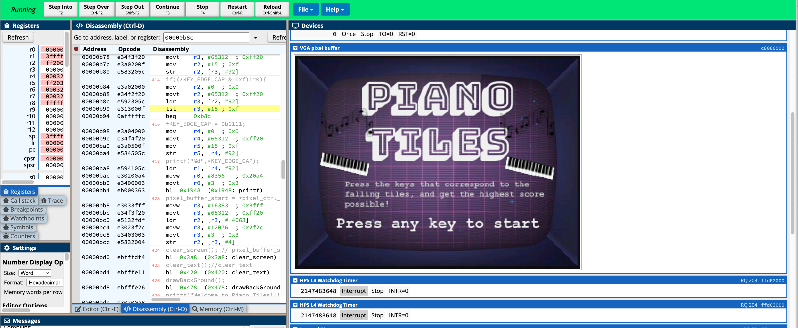
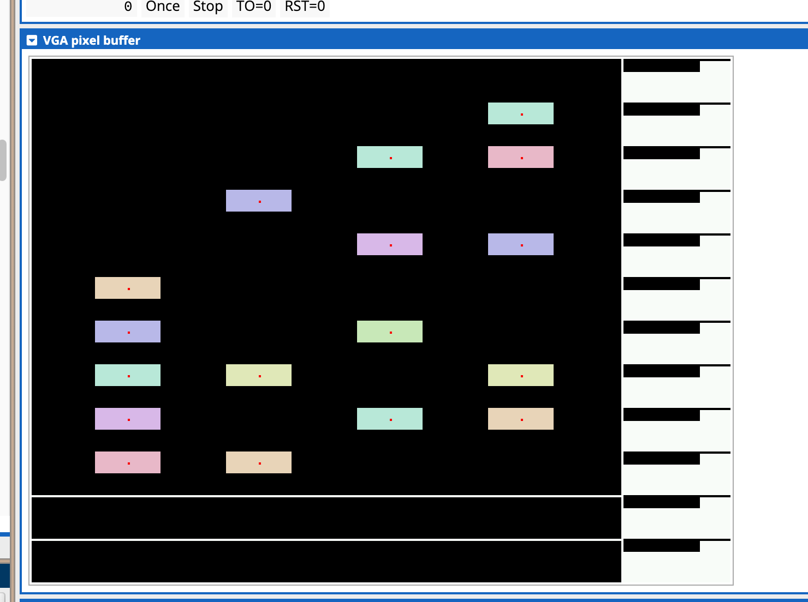
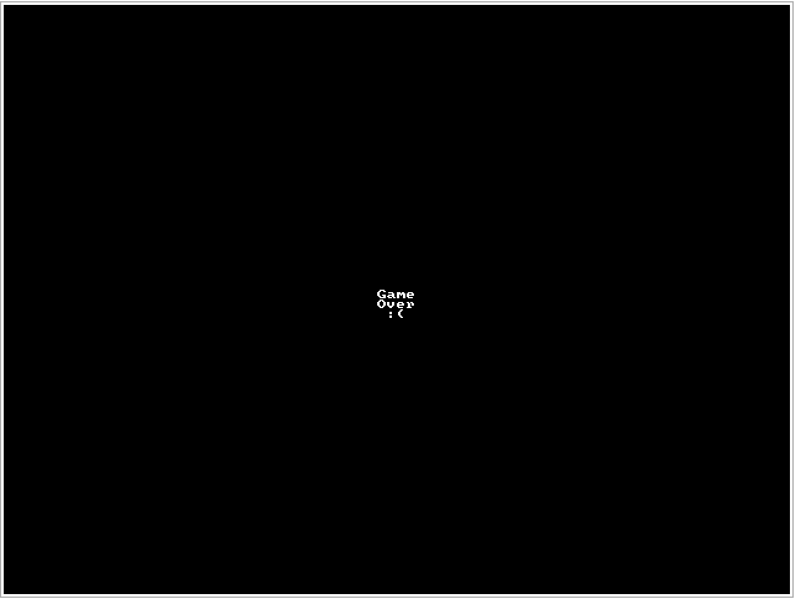

# Piano-Tiles-Game

This simple Piano Tiles Game is written in C. 
The game can be loaded up on a DE1-SOC board that is connected to a VGA display to be played using the push buttons. 
The score a player has is displayed via the HEX display. 
The Health bar status is displayed on the LED strip
Random keypresses when no tile is at the end screen will be ignored. 

It can also be loaded on [CPU-LATOR](https://cpulator.01xz.net/?sys=arm-de1soc&d_audio=48000) using the following configuration:
* Architecture: ARMv7
* System: ARMv7 DE1-SOC v16.1

Here is the opening screen

Here is some of the gameplay visuals

To Start Game:
1. Instructions are provided at terminal if using CPULator and the start screen
2. If playing game on hardware, first begin by pressing any key on the FPGA board. This will tell
the program to start and have the tiles start dropping down.
3. Once the game has started, players can use the keys to interact with the program.
    a. Random key presses will be simply ignored by the program` and will not impede the game of play.
    b. Key presses are only significant when a tile has reached the end zone(region formed by two white lines). The program will respond to those key presses to determine whether a point will be awarded or not.
4. The current Score and Health bar are respectively displayed on the HEX display and LED.
5. When all the LED lights are on, it means that player is at full health
    a. The LED lights will start to disappear if player misses a few tiles
    b. In total if 10 tiles are missed, the game will end.
6. The score will be updated every iteration on the HEX display up to 1000 points.
7. Game ends when the health bar depletes to 0 as shown on the LED.
